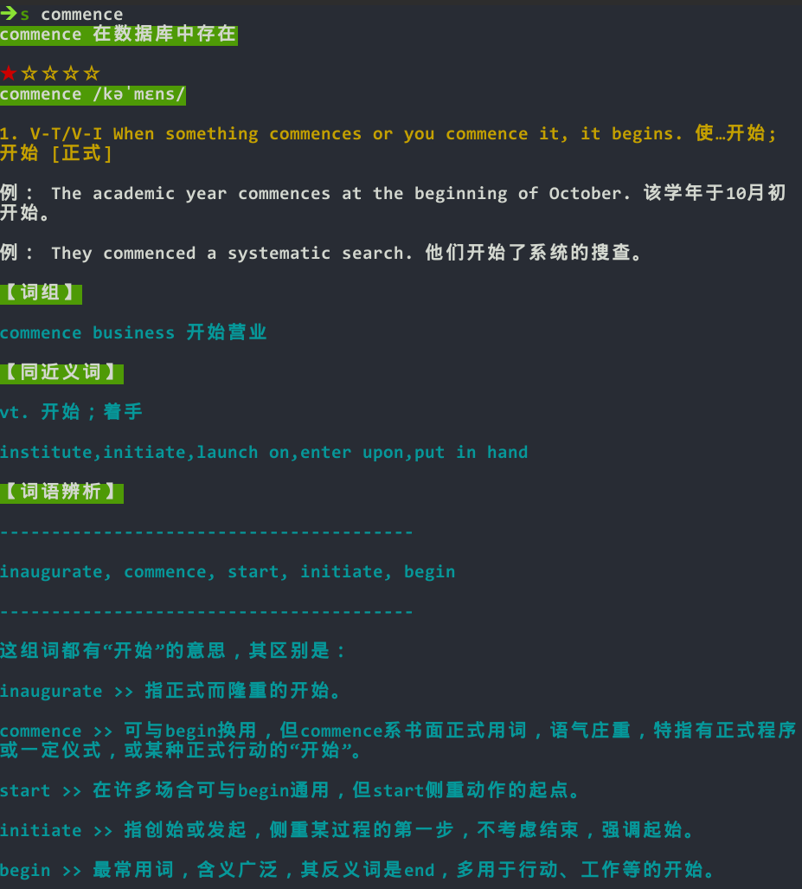

# isearch

一款命令行单词查询/管理工具，词义来源于[有道词典](http://dict.youdao.com/)

通过插入/查询数据库可以离线使用。

设置了优先级，方便单词的巩固和背诵。

# 简单设置

首先在`isearch.py`代码中设置你的数据库路径。

然后alias一下，下面是将`python isearch.py`命名为`isearch`

记得备份数据库文件，防止意外丢失。

# 使用方法

参数说明：
>-a     --add        添加单词
>
>-d     --delete     删除单词
>
>-p     --priority   列出优先级大于某个值的单词
>
>-l     --latest     列出最近加入的单词')
>
>-c     --catalog    列出A-Z开头的单词目录
>
>-s     --set        设置单词的优先级
>
>-h     --help       查看帮助
>
>-v     --verbose    查看详细信息
>
>-o      -output     输出模式



直接查询
```
isearch [单词]
```

添加到数据库 （默认优先级为 1）
```
isearch -a [单词]
```

从数据库中删除

```
isearch -d [单词]
```

设置优先级 （1 到 5）

```
isearch -s [优先级1-5] [单词]
```

列出某个优先级及以上的单词

```
isearch -p [优先级1-5] [单词] -v（详细模式） -o（输出模式）
```

列出最近添加的N个单词

```
isearch -l [数目N] -v（详细模式） -o（输出模式）
```

列出以某个字母开头的所有单词

```
isearch -c [a-z] -v（详细模式） -o（输出模式）
```


